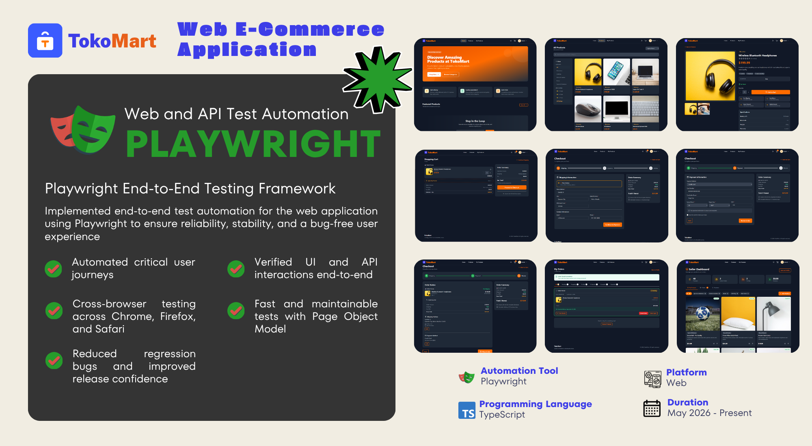

<div align="center">

<h1 class="work-title">
  <a href="https://github.com/cjp-engr/cjp-shopping-app/tree/main/e2e-testing" target="_blank" rel="noopener">
    TokoMart E2E Testing (Playwright)
  </a>
</h1>

Web UI and API tests for TokoMart in one Playwright project.

  

</div>

---

## Best Practices

### Storage State (auth setup)

Auth is handled once per run via setup projects — never log in through the UI inside individual tests.

- **`buyer.setup.ts`** logs in via API, injects token into `localStorage`, then saves `.auth/buyer.json`.
- **`seller.setup.ts`** does the same for the seller account, promoting to seller role if needed.
- Tests in `web-buyer` and `web-seller` projects receive the saved state automatically via `storageState` in `playwright.config.ts` — no login step needed in those test files.
- **`web-mixed` project has no `storageState`** — tests that switch between buyer and seller (e.g. cart isolation, order isolation) must manage auth themselves using `signupFreshUser()` or the API login helper.
- **Never call the login UI in a web E2E test.** Use the saved `storageState` or, for fresh accounts, `signupFreshUser()` from `helpers/api-client.ts`.
- **Do not share `storageState` files between CI jobs** without clearing server-side state first. `buyer.setup.ts` clears the cart via API before saving so the snapshot starts clean.
- **Product seeds in `beforeAll`** must include `shippingOptions` and `shippingFee` — the backend rejects product creation without them. Use `randomShipping()` (JSON body) or `randomShippingMultipart()` (multipart) from `helpers/test-data.ts`.

### Web E2E (`tests/web/`)

**Structure**
- TC-* ID in the file header comment on line 1.
- Self-contained: rely on `storageState` for auth; no shared mutable state between tests.
- No `test.only()` or `test.skip()` left in committed files.

**Locator priority — scope first, then pick the most stable locator inside the scope**
1. Structural anchor for repeated UI: `getByTestId('cart-seller-group-{sellerId}')`, `getByTestId('product-card-{id}')`, `getByTestId('order-card-{id}')`
2. Inside a scope: role + accessible name: `sellerGroup.getByRole('button', { name: 'Apply voucher' })`
3. Fallback: element testid when role/name is ambiguous: `getByTestId('select-voucher-btn-{sellerId}')`
4. Scoped stable text only: `paymentSection.getByText('Cash on Delivery')`
5. **Never:** XPath, CSS chains, `nth-child`, unscoped dynamic text (prices, order IDs, product names), `waitForTimeout`

**Multi-seller scoping**
Always anchor cart/checkout locators to `cart-seller-group-{sellerId}` before using role or text. Unscoped selectors in multi-seller UI are an [IMPORTANT] finding.

**Waits**
Never use `waitForTimeout`. Use `expect(locator).toBeVisible()` or Playwright's built-in auto-wait.

**Assertions (domain rules)**
- Use persisted `order.total` — not the sum of raw line prices.
- Assert `"Cash on Delivery"` label, not the `"cash-on-delivery"` slug.
- Per-seller tax and shipping lines must appear separately on multi-seller checkout.
- Sale items: assert discounted price + strikethrough original.

### API (`tests/api/`)

**Structure**
- File named `*.api.spec.ts`; uses `request` fixture only — no `page`.
- Auth via `helpers/api-client.ts`: `login()`, `authHeaders()`, `signupFreshUser()`.
- Each `test.describe` block maps to one or more `TC-*` IDs.

**Fresh accounts**
Use `signupFreshUser(request, 'prefix')` for tests that need a clean user. Never depend on shared seeded state changing between runs — use `beforeAll` to create what the test needs.

**Product creation — required shipping fields**
`shippingOptions` and `shippingFee` are required by the backend. All product creation calls must include them. Use the helpers from `helpers/test-data.ts`:
- JSON-body requests: spread `randomShipping()` into `data`
- Multipart requests: spread `randomShippingMultipart()` into `multipart` (arrays are pre-serialized to JSON strings)

When `shippingFee` is `buyer_pays`, `randomShipping()` also generates `shippingFeeAmounts` with a random fee per selected delivery option.

**Assertions**
Assert all three layers: status code + `body.success` + `body.message`. Check `backend/NOTES.md` for the exact error string from the backend source.

---

## Prerequisites

```bash
cd backend && npm run seed && npm run dev   # :5000
cd frontend && npm run dev                  # :5173 (web tests only)
```

## Setup

```bash
cd e2e-testing
cp .env.dev.example .env.dev   # seller + buyer credentials for local runs
npm install
npx playwright install chromium
```

## Run

```bash
npm test              # all
npm run test:api      # API only (backend required)
npm run test:web      # web UI (backend + frontend required)
npm run test:ui       # interactive UI mode
npm run report        # open HTML report
```

## QA pipeline

```
/create-scenarios → /test-strategy → /generate-tests → /review-tests
```

| Stage | Output |
|-------|--------|
| create-scenarios | `docs/test-cases/test-scenarios*.md` |
| test-strategy | `docs/test-strategies/test-strategy*.md` |

Generated tests land here; map each file to `TC-*` IDs in comments.

## Test coverage

### API (`tests/api/`)

| File | TC IDs | Description |
|------|--------|-------------|
| `auth.api.spec.ts` | — | Login, GET /me, invalid credentials |
| `health.api.spec.ts` | — | API server health smoke |
| `orders.api.spec.ts` | TC-025, TC-026, TC-027, TC-028, TC-033, TC-056 | Order totals, seller-configured shipping, multi-seller split, cancel guard, stock validation |
| `security.api.spec.ts` | TC-132, TC-133, TC-134, TC-135, TC-136 | Protected routes return 401, tampered JWT rejected, seller order scoping (IDOR), buyer blocked from seller routes, weak password rejected |
| `seller-access.api.spec.ts` | TC-048, TC-053, TC-054 | Buyer blocked from seller routes, cross-seller edit/delete blocked, invalid status transition |
| `reviews.api.spec.ts` | TC-035, TC-036 | Duplicate review blocked, review before delivery blocked |
| `coupons.api.spec.ts` | TC-057 | Coupon below minimum order amount |
| `cart.api.spec.ts` | TC-107, TC-108, TC-109 | Cart returns buyer's own items, cart isolation between buyers |
| `order-isolation.api.spec.ts` | TC-110, TC-111 | Order list isolation, order detail ownership (403) |
| `rate-limit.api.spec.ts` | TC-114–TC-119 | Rate limiting across auth, orders, and review endpoints |
| `users.api.spec.ts` | TC-113 | User profile read and update |

### Web E2E (`tests/web/`)

| File | TC IDs | Description |
|------|--------|-------------|
| `buyer/login.spec.ts` | TC-001 | Buyer login, authenticated navbar |
| `buyer/product-browse.spec.ts` | TC-010, TC-011 | Search by keyword, filter by category |
| `buyer/product-detail.spec.ts` | TC-012, TC-013, TC-014 | Sale price display, variant selection, add-to-cart guard |
| `buyer/checkout.spec.ts` | TC-022, TC-023, TC-024 | Checkout COD, saved card, new card |
| `buyer/variant-checkout.spec.ts` | TC-098, TC-105, TC-106 | Checkout with variant product across payment methods |
| `seller/seller-product-wizard.spec.ts` | TC-064 | Seller creates variant product via wizard, verifies on detail page |
| `seller/seller-simple-product-crud.spec.ts` | TC-042, TC-044, TC-045, TC-046, TC-122 | Simple product CRUD: create, edit, preview, delete, My Products list |
| `seller/seller-variant-product-crud.spec.ts` | TC-120, TC-121, TC-046 | Variant product edit, buyer preview, delete |
| `seller/seller-access.spec.ts` | TC-054 | Seller dashboard shows only own products |
| `mixed/cart-isolation.spec.ts` | TC-109 | Buyer2 sees own empty cart, not buyer1's items |
| `mixed/order-isolation.spec.ts` | TC-112 | Buyer2 sees only own order history, not buyer1's orders |
| `mixed/product-catalog-visibility.spec.ts` | TC-008, TC-065 | Guest browse, seller listing visible to buyer in catalog |
| `mixed/role-switch.smoke.spec.ts` | — | Auth state switching smoke test |

| Folder | Type | Pattern |
|--------|------|---------|
| `tests/web/` | Browser E2E | `*.spec.ts` |
| `tests/api/` | HTTP API | `*.api.spec.ts` |

Mobile tests remain in `frontend-mobile/patrol_test/` (Patrol).
